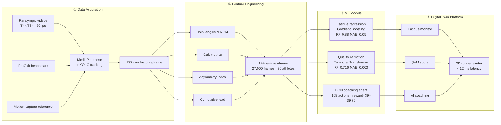

 

**A digital twin that watches a blade runner's stride and tells you — before their body does — that fatigue is building.**

---

### 📌 Why this exists

A blade runner's prosthesis gives them speed but takes away feedback — there's no proprioception in a carbon-fiber blade. Fatigue and asymmetric loading build up silently, invisible to the athlete and to every wearable built for able-bodied gait. **BladeX-m watches instead of waiting**: it turns ordinary competition video into a live biomechanical readout of fatigue, movement quality, and coaching guidance.

> Existing wearables misestimate energy expenditure in prosthetic users because they're calibrated on symmetric, able-bodied gait. BladeX-m is built from the ground up on real blade-runner biomechanics.

---

### 🧭 At a glance

| | |
|---|---|
| **Athletes** | 30 real-world blade runners (T44/T64) |
| **Data** | 27,000 annotated frames · 144 biomechanical features/frame |
| **Fatigue model** | Gradient Boosting → R² = 0.88 · MAE = 0.05 · AUC = 0.972 |
| **Quality-of-Motion model** | Temporal Transformer → R² = 0.716 · MAE = 0.003 |
| **Coaching agent** | Deep Q-Network → 108 actions · reward converged at 39–39.75 |
| **Platform latency** | < 12 ms, end to end |
| **Validation** | Kinematics cross-checked against IAAF reference values |

---

### 🏃 Pipeline

Video comes in on the left; a live coaching decision comes out on the right. Four stages, each color-coded, each traceable back to real athlete data.

<b>Prefer it as a flowchart?</b> (click to expand)

---

### 🧠 The models

<table>
<tr>
<td width="33%" valign="top">

**ParaRunner Fatigue Regressor**

Gradient Boosting over 144 biomechanical features, split by `runner_id` so no athlete leaks across train/test.

`R² 0.88` `MAE 0.05` `AUC 0.972`

*Cumulative impact load, not speed, is the top predictor (SHAP ≈ 0.70).*

</td>
<td width="33%" valign="top">

**Quality-of-Motion Scorer**

A Temporal Transformer reading 30-frame windows of speed, joint angles, and asymmetry — a novel construct for prosthetic running.

`Test R² 0.716` `MAE 0.003`

*Small train/test gap → generalizes without overfitting.*

</td>
<td width="33%" valign="top">

**DQN Coaching Agent**

Maps a 15-dim biomechanical state to one of 108 coaching actions: intensity × rest × focus × adjustment.

`Reward → 39–39.75` `ε: 0.80 → 0.02`

*Treats asymmetry as an injury risk independent of fatigue level.*

</td>
</tr>
</table>

---

### 🖥️ The platform

BladeX-m renders a live 3D runner avatar — prosthetic blade included — driven directly by the CV pipeline, with a side panel streaming all three models at once:

- **AI Coaching** — intensity, rest duration, focus area, adjustment level
- **Quality of Motion** — Good / Warning / Critical, updated live
- **Fatigue Monitor** — current score with a plain-language status ("Performance maintained", "Fatigue levels within normal range"...)

Everything a coach or sports clinician needs, on one screen, with no lab hardware.

---

### 📊 Data sources

| Source | What it contributes |
|---|---|
| Real Paralympic competition footage (Paris 2024, Tokyo 2020) | Real-world fatigue signal, T44/T64 athletes |
| [ProGait](https://arxiv.org/abs/2507.10223) benchmark | Clean, controlled validation for transfemoral users |
| Published motion-capture protocol | Ground truth for joint angles, gait phases, asymmetry |

Fatigue itself isn't observable in video, so it's operationalized as a transparent degradation index — the drop in speed, range of motion, and rise in ground-contact time relative to each athlete's own fresh-state baseline (first 10–30 s of the sprint).

---

### 🔭 Limitations & what's next

- This is a **video-driven simulation** of a digital twin, not yet a full physics-based one — embedded IMUs and pressure insoles are the next step toward true real-time sensing.
- The QoM transformer is capped by dataset size (~900 frames/athlete); more data or a hybrid CNN–Transformer should close the gap with the fatigue model.
- Planned: socket-embedded sensors, EMG–IMU fusion, edge deployment, and extending beyond unilateral transtibial athletes to bilateral and transfemoral populations.

---

### 🧰 Tech stack

`Python` · `MediaPipe` · `YOLO` · `scikit-learn (Gradient Boosting)` · `PyTorch (Transformer, DQN)` · `SHAP` · web-based 3D visualization

### 👥 Team 7

Shahd Salah · Shaimaa Abdelaziz · Jana Gamal · Mariam Hosny · Nada Mostafa · Hamdy Ahmed

### 📖 Citation

> Salah, S., Abdelaziz, S., Gamal, J., Hosny, M., Mostafa, N., Ahmed, H. *Digital Twin System for Fatigue Monitoring and Injury Prediction in Para-Athletes Using Prosthetic Blade Running.* Team 7.
